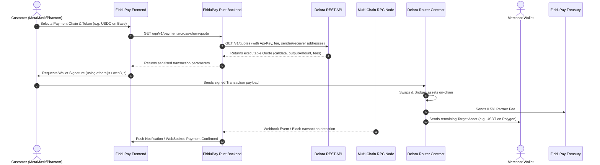

# FidduPay - Delora Partnership Integration Plan

This document details the comprehensive integration strategy, system architecture, API endpoints, webhook handling, error management, transaction retries, and security mechanisms for integrating the **Delora Protocol** cross-chain routing infrastructure into the **FidduPay** monorepo.

---

## 1. What is Delora?
Delora is a high-performance cross-chain routing infrastructure that aggregates bridges and decentralized exchanges (DEXs) across both EVM (Ethereum Virtual Machine) and SVM (Solana) networks. It offers:
* **API Endpoints (`GET /v1/quotes`, `GET /v1/chains`, etc.):** Used to fetch the best cross-chain route and return executable transaction payload (`calldata`).
* **Pre-built Web Widgets:** Widgets that can be customized and embedded directly on checkout pages.
* **Integrator Fee Configuration:** A monetization mechanism to take custom commission cuts on transactions routed through the system.

---

## 2. Core Benefits of Delora to FidduPay
FidduPay is a multi-chain cryptocurrency payment gateway supporting 10 specific cryptocurrencies across 5 blockchains. Integrating Delora addresses several limitations and unlocks new capabilities:

### A. Universal Cross-Chain Checkout (Any Token → Merchant Asset)
* **Current Limitation:** If a merchant wants to receive `USDT (Polygon)` but the customer only has `USDC` on `Base` or `SOL` on `Solana`, the customer must exit your platform, manually bridge/swap their assets on external platforms, and then come back to pay.
* **Delora Solution:** Delora routes and swaps assets on-the-fly. The customer can pay with **any token on any EVM/SVM chain**, and Delora will bridge, swap, and deliver the exact merchant-configured target token (e.g., `USDT` on `Polygon` or `USDT` on `Solana`) to the merchant's sub-account or wallet in a single flow.

### B. Direct Monetization (New Revenue Stream)
The Delora API and Widget support an optional fee parameter (e.g., `0.01` for 1%) and integrator identifier:
```http
GET https://api.delora.build/v1/quotes?amount=10000000&originChainId=1&destinationChainId=137&fee=0.005&integrator=fiddupay
```
Every time a customer makes a cross-chain payment via your gateway, FidduPay can take a custom cut (e.g., `0.5%` or `1%`) of the swap, adding a passive revenue stream to your business model.

### C. Expansion to More Blockchains & Tokens
FidduPay currently supports Solana, Ethereum, BSC, Polygon, and Arbitrum. Delora can instantly extend your reach to other popular networks (like **Base, Optimism, Avalanche, Linea, Scroll, etc.**) and hundreds of ERC-20/SPL tokens without you having to write custom node integration logic or manage RPCs for those additional networks.

### D. Frictionless Wallet Management
Delora handles multi-wallet connections seamlessly (`Phantom` for Solana, `MetaMask`/`Rabby`/`Rainbow` for EVM) and manages EVM-to-SVM recipient mapping so you don’t have to build custom cross-chain wallet linking logic from scratch.

---

## 3. How You Can Integrate Delora into FidduPay
There are two primary ways you can add Delora to the FidduPay ecosystem:

### Option 1: Embedding the Delora Widget (Frontend-only, Low-Code)
If you want to quickly test or add this functionality to the FidduPay Payment Page (`frontend` or `p2p-frontend`):
1. Install the `@deloraprotocol/widget` package in your frontend.
2. Embed the widget directly inside the payment checkout component.
3. Configure the destination address to be the merchant's target address, and lock the destination currency to what the merchant is expecting.
* **Pros:** Incredibly fast to implement (takes minutes); handles UI, wallet connections, and slippage calculations automatically.

### Option 2: Using the Delora REST API (Full Custom UI, Custom Flow)
If you want to maintain a highly branded checkout interface (e.g., keeping your current 0-conf payment screen):
1. Call `GET https://api.delora.build/v1/quotes` from the frontend or backend when a customer selects a non-standard payment token.
2. Display the estimated exchange rate, fees, and final expected output to the user.
3. Use the returned `calldata` (which includes target address, data, and value) to request the user's signature using standard Web3 libraries (such as `ethers.js` or `@solana/web3.js`).
* **Pros:** Seamless integration with FidduPay's existing webhook notifications, custom payment tracking database, and merchant dashboards.

---

## 4. Partnership Benefits with Delora
If you officially partner with Delora, here are the direct advantages:
* **Higher API Rate Limits:** Standard API calls have strict rate limits. By registering on the **Partner Portal** ([portal.delora.build](https://portal.delora.build)) and obtaining an API key (`x-api-key`), FidduPay gets elevated throughput to handle high volumes of merchant checkout queries.
* **Custom Revenue / Fee Setup:** You gain access to dashboard tracking for your developer/integrator fees, making it easy to monitor and withdraw your earnings from cross-chain transactions.
* **Direct Partner Support:** Direct access to the core team via Telegram (`@whoisfedelya`) to assist with custom smart contract integrations.
* **Co-Marketing:** Opportunities to be featured on Delora's connected app directory and announcements, exposing FidduPay to wider communities across EVM and SVM networks.

---

## 5. Can users use it to deposit funds into their FidduPay wallets?
**Yes, absolutely!** You can use Delora in two different deposit/payment flows:

### Flow A: The "Direct Deposit" (Funding the Wallet)
If a user wants to fund their personal FidduPay wallet:
1. They open their FidduPay dashboard and click **Deposit**.
2. They select their target wallet (e.g., `USDT` on `Arbitrum`).
3. You present the Delora widget or quote API on the screen.
4. The user connects their MetaMask/Phantom wallet and swaps any asset they own (e.g., `SOL` on Solana or `USDC` on Base).
5. Delora bridges it, and the converted `USDT` is deposited directly into their designated Arbitrum wallet address on FidduPay.

### Flow B: The "Bridge-to-Pay" Checkout (No Pre-deposits Needed)
This is even more powerful for merchant customers:
1. Instead of making customers deposit funds into a FidduPay wallet first, bridge them, and then execute the payment, Delora executes this **atomically in one transaction**.
2. When checking out at a merchant store, the customer initiates a bridge-and-swap from their personal external wallet, and the destination address is set directly to the merchant’s FidduPay deposit address.
3. The customer signs one transaction, and the merchant gets paid in their preferred asset instantly.

---

## 6. The "Maximum Power" Strategy: How to leverage Delora to dominate
To get the absolute maximum value out of Delora for FidduPay, implement this three-pronged architecture:

### System Architecture Flow Chart

#### 1. Visual Sequence Flow
```text
Customer            FidduPay            FidduPay            Delora              RPC Node           Merchant
(Wallet)            Frontend            Backend             API / Contract      (Block tracking)   Wallet
   │                   │                   │                   │                   │                 │
   │──(1) Select SOL──>│                   │                   │                   │                 │
   │                   │──(2) Get Quote───>│                   │                   │                 │
   │                   │                   │──(3) Fetch Quote─>│                   │                 │
   │                   │                   │   (integrator/fee)│                   │                 │
   │                   │                   │<──(4) Return Tx───│                   │                 │
   │                   │<──(5) Send Param──│                   │                   │                 │
   │<──(6) Sign Tx─────│                   │                   │                   │                 │
   │──────────────────────────────────────────────────────────>│                   │                 │
   │                   │                   │                   │ (Executes Swap)   │                 │
   │                   │                   │                   │──(7) 0.5% Fee ───> [FidduPay Treasury]
   │                   │                   │                   │──(8) Pays USDT───>│────────────────>│
   │                   │                   │                   │                   │                 │
   │                   │                   │<──────────────────────────────────────│ (Tx Confirmed)  │
   │                   │<──(9) Confirmed ──│                   │                   │                 │
```

#### 2. Raw Mermaid Spec



### ⚡ Power Move 1: The "Any-to-Any" Merchant Checkout
* Integrate the Delora API directly into your main checkout template.
* When a merchant generates an invoice for $100 USD worth of `USDT` on `Polygon`, show a dropdown to the customer: *"Pay with any token/chain."*
* If they choose `SOL` on Solana, FidduPay calls the Delora API to get a quote from Solana (`SOL`) to Polygon (`USDT`).
* Your gateway displays a single transaction prompt. The customer pays in `SOL`, and your backend monitors the Polygon blockchain for the incoming routed `USDT` to mark the order as paid.

### ⚡ Power Move 2: "Cross-Chain P2P Escrow"
* In your P2P exchange frontend, allow buyers to fund their escrow trades using cross-chain assets.
* A buyer can buy local currency (e.g., NGN, KES) by bridging and swapping their assets directly into the FidduPay Escrow Smart Contract in one step via Delora.

### ⚡ Power Move 3: Automated Micro-Fee Arbitrage (Monetization)
* Programmatically append a `0.5%` or `1.0%` integrator fee to all Delora quotes.
* For every cross-chain deposit or invoice paid, FidduPay automatically pockets a risk-free convenience fee. Because the fee is processed by Delora's smart contracts, it is routed straight to your integrator wallet on-chain.

---

## 7. API Routes & Functions (FidduPay Backend)

To support custom quote rendering and validation on the backend:

### A. Get Cross-Chain Quote
* **Route:** `GET /api/v1/payments/cross-chain-quote`
* **Access:** Public (Customer Checkout Page)
* **Function:** `get_cross_chain_quote(req: QuoteRequest) -> Result<Json<QuoteResponse>, ApiError>`
* **Parameters:**
  * `invoice_id` (UUID): The target invoice being paid.
  * `sender_address` (string): The customer's wallet address on the origin chain.
  * `origin_chain_id` (number): e.g., `8453` (Base).
  * `origin_currency` (string): e.g., token address of `USDC` on Base.
* **Internal Logic:**
  1. Fetch invoice details from database to identify merchant destination address, destination chain, expected asset, and invoice target amount.
  2. Query Delora API `/v1/quotes` passing client parameters and `integrator=fiddupay&fee=0.005`.
  3. Respond with sanitized executable parameters (`to`, `value`, `calldata`).

### B. Register Transaction Hash
* **Route:** `POST /api/v1/payments/cross-chain-register`
* **Access:** Public (Customer Checkout Page)
* **Function:** `register_cross_chain_tx(payload: RegisterTxPayload) -> Result<StatusCode, ApiError>`
* **Parameters:**
  * `invoice_id` (UUID)
  * `tx_hash` (string)
  * `origin_chain_id` (number)

---

## 8. Webhooks, Error Management, and Retries

### A. Webhooks & Transaction Verification
* FidduPay monitors destination networks for incoming payment logs.
* If a transaction signature is registered, a background worker verifies it via RPC query or Delora's transaction tracking status APIs to guarantee delivery to the merchant sub-account before finalizing the invoice.

### B. Quote Expirations & Slippage Tolerance
* Cross-chain swap transactions have a quote expiry window (typically 60-120 seconds).
* **Handling:** If the customer transaction fails to execute before expiry, the frontend fetches a fresh quote automatically.
* **Slippage protection:** A default slippage of `0.5%` ensures protection against sandwich attacks during cross-chain routing.

### C. Warnings & API Limits
* Handle warnings such as `SOLANA_INSUFFICIENT_BALANCE` by instructing the user to top up native fuel fee assets prior to initiating the bridge.
* Partnership API keys must be used on every request to bypass default public API rate limits.

---

## 9. Security Handling

* **Calldata Sanitization:** FidduPay backend validates that returned execution fields (`to`) strictly match registered Delora Diamon Router contracts to prevent payload manipulation.
* **Recipient Verification:** The frontend script checks that the final destination address matches the merchant’s secure sub-account address.
* **Revenue Isolation:** Partner fees are directly received by the secure **FidduPay Treasury Wallet** managed in safe environment variables.
