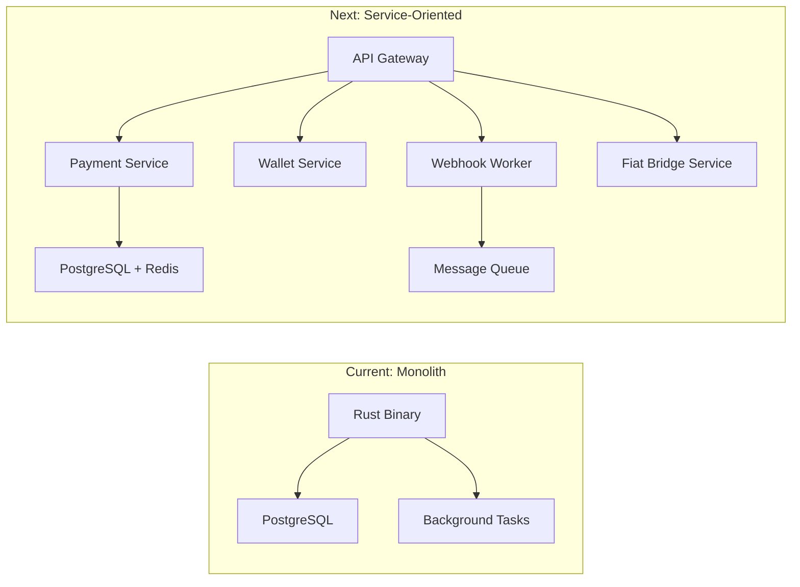
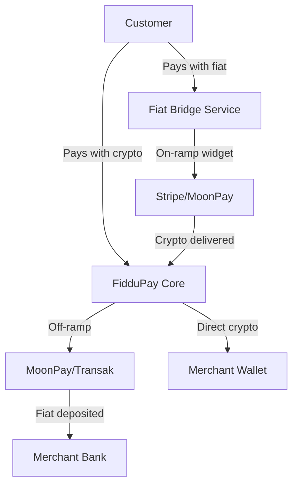

# FidduPay — Codebase Review & Scaling Strategy

## Part 2: Scaling Strategy

### Architecture (Current → Next)

### Immediate Scaling Wins (No Architecture Change)

| Area | Action | Impact |
|------|--------|--------|
| **Caching** | Add Redis for price caching, rate limiting, and session store | Reduces DB load 60%+ |
| **Connection pooling** | Enable PgBouncer on Railway | Handles more concurrent connections |
| **Webhook delivery** | Move to a job queue (Tokio channels → Redis/NATS) | Reliable delivery, observability |
| **Horizontal scaling** | Run 2+ Railway instances behind load balancer | 2× throughput |
| **CDN** | Put frontend behind Cloudflare/Vercel Edge | Faster global loads |

### Medium-Term (3-6 months)

1. **Extract webhook worker** into separate process — webhooks shouldn't block payment processing
2. **Add Redis** for rate limiting (currently in-memory, lost on redeploy), price caching, and pub/sub for real-time updates
3. **Database read replicas** for analytics queries — heavy analytics queries shouldn't slow payment processing
4. **WebSocket connections** for real-time payment status on the payment page (instead of polling)

### Long-Term (6-12 months)

1. **Microservices split** — Payment core, wallet management, and webhook delivery as separate deployable services
2. **Event sourcing** for payment state — audit trail and replay capability
3. **Multi-region deployment** — Railway supports multi-region; add latency-based routing

---

## Part 3: Fiat Currency Integration

### Recommended Approach: Don't Build It — Integrate

Building fiat processing requires money transmitter licenses, banking partnerships, and compliance infrastructure. Instead, integrate with established providers:

### 🏆 Tier 1 Recommendations

| Provider | Best For | KYC/AML | Coverage | Integration |
|----------|----------|---------|----------|-------------|
| **Stripe Crypto Onramp** | Fiat → Crypto on-ramp | Stripe handles everything | 190+ countries | Embeddable widget + API |
| **MoonPay** | Both on-ramp and off-ramp | Managed KYC | 160+ countries | Widget, SDK, API |
| **Transak** | DApp/wallet integration | Compliance framework | 170+ countries | Embeddable widget |

### 🥈 Tier 2 (Aggregators)

| Provider | Value Prop |
|----------|-----------|
| **OnRamper** | Aggregates 25+ on-ramp providers via single API, finds cheapest route |
| **Ramp Network** | Strong Web3 focus, manages KYC/AML |

### 🌍 Africa-Specific (if relevant to your market)

| Provider | Coverage |
|----------|----------|
| **Paystack** (Stripe-owned) | Fiat payments in Nigeria, Ghana, South Africa, Kenya |
| **Flutterwave** | Pan-African coverage, USD + local currencies |

> [!IMPORTANT]
> Paystack/Flutterwave are **fiat-only** — they don't handle crypto. You'd use them alongside your crypto engine: merchant receives payment in crypto through FidduPay, then the off-ramp provider converts to fiat and deposits to the merchant's bank.

### Suggested Integration Architecture

### Implementation Steps

1. **Start with Stripe Crypto Onramp** — Easiest to integrate, handles all compliance, truested brand
2. **Add MoonPay for off-ramp** — Let merchants convert crypto earnings to fiat
3. **Optional: Add Paystack/Flutterwave** for direct fiat collection in African markets
4. **Create `fiat_bridge_service.rs`** — Abstraction layer over whichever provider(s) you integrate
5. **Add fiat payment option to checkout page** — "Pay with Card" button alongside crypto options

### Key Decision

> [!TIP]
> **Start with Stripe Crypto Onramp.** It has the best developer experience, handles KYC/AML/fraud/disputes for you, and their brand builds trust with end users. You can add MoonPay as a secondary provider later for markets Stripe doesn't cover.
